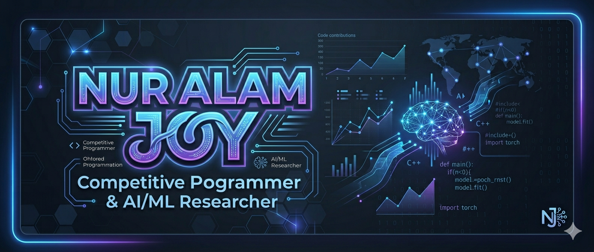

  
  # Hi there, I'm Nur Alam Joy! 👋

  

    
  

  

    
    
    
    
  

  

    
  

### 🔭 About Me

👋 Hello! I'm Nur Alam Joy, a passionate Computer Science student, competitive programmer, and aspiring AI/ML researcher.

- 🎓 I'm currently pursuing a B.Sc. in Computer Science and Engineering (CSE) at **Premier University, Chittagong**.
- 💻 I love solving Data Structures and Algorithms (DSA) problems and have solved **2000+ algorithmic problems** across various competitive programming platforms.
- 🤖 I'm currently exploring **Artificial Intelligence and Machine Learning**, with a particular interest in **Multimodal AI**, **Explainable AI (XAI)**, and **AI-driven Complexity Analysis of Algorithms**.
- 🔬 My research interests include **Machine Learning**, **Software Engineering**, **Program Analysis**, **Competitive Programming Analytics**, and **Large Language Models (LLMs)**.
- 🌱 I'm open to collaborating on **MERN Stack**, **AI/ML**, and **research-oriented projects**.
- 🏆 Achievements:
  - **ICPC Asia Dhaka Regional Finalist 2024**
  - Participated in **15+ Inter University Programming Contests (IUPC)**
  - Solved **2000+ problems** on various online judges
- 🎯 Career Goal: Contribute to research in AI and Software Engineering.
- 📫 Reach me: ajnuralam@gmail.com
- ⚡ Fun Fact: I enjoy breaking down complex algorithmic challenges and transforming research ideas into practical solutions.

# 💻 Tech Stack:

                                                 

### 📊 My GitHub Stats

  <h3>📈 GitHub Activity Graph</h3>
  
  

      <h3>📜 Language and Overview</h3>
      

        
        
      

    

   
  

    

      <h3>📜 Overall GitHub Stats</h3>  
      

        
        
        
      

    

    

      <h3>🔥 GitHub Streak</h3>
      
    

  

<picture>
  <source media="(prefers-color-scheme: dark)" srcset="https://raw.githubusercontent.com/nuralamjoy/nuralamjoy/output/pacman-contribution-graph-dark.svg">
  <source media="(prefers-color-scheme: light)" srcset="https://raw.githubusercontent.com/nuralamjoy/nuralamjoy/output/pacman-contribution-graph.svg">
  
</picture>
